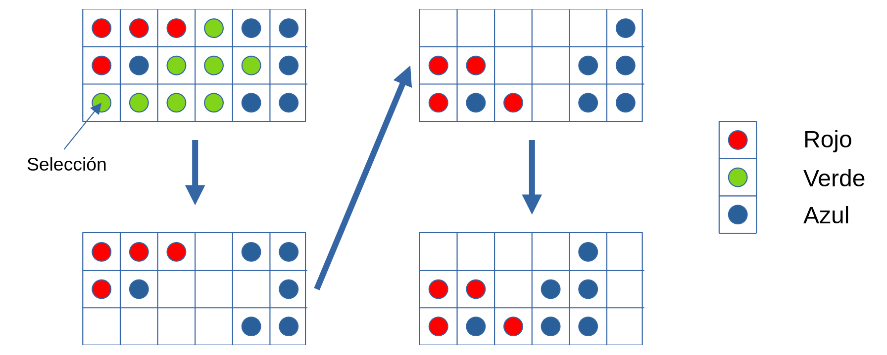

The game called "Equal tiles" is played on a rectangular array of f x c positions, with 1 <= f,c <= 20. Each position contains a red (R), green (G) or blue (B) tile or is empty. Two tiles belong to the same group if they have the same color, and one can be reached from the other by following tiles of the same color in the four directions up, down, left and right (not diagonally). At each step of the game, the player chooses a tile whose group has at least two and removes all tiles in the group from the board. Then, the board is "compressed" in two steps: 

    The remaining tiles in each column are moved down to fill the empty spaces. The order of the checkers in each column is preserved. 
    If a column becomes empty, the remaining columns are moved to the left as far as possible. The order of the columns is preserved. 

For example, choosing the tile in the lower left corner of the given subtable on the chart causes the given moves to be in that order.

The object of the game is to remove all the tiles from the board and the game ends when all the tiles have been removed or when each group has only one tile. 

The scoring for each game is as follows. The player starts with a score of 0. When a group of m tiles is removed, the player's score increases in left parentheses m minus 2 squared right parentheses. A bonus of 1000 points is awarded if all tiles are removed at the end of the game.

You want to create a program that gives the optimal strategy for any game, i.e. the set of moves that gives the highest possible score. 

A move will always be determined by the leftmost and lowest possible tile in its group. If there are two different solutions with the same maximum score, the first solution will be given in ascending lexicographic order with respect to the set of coordinates that form the solution, which in turn will be ordered lexicographically in ascending order.

> [!NOTE]
> The input to the program will consist of a series of sets. The first input line will contain a positive integer indicating the number of games. The initial arrangement of tokens in each set is given by f rows, one row in each line, from top to bottom. Each row contains c characters, each of which is one of "R", "V" or "A", specifying the colors of the tiles in the row from left to right. Thus the game will be played on a board of f x c positions. A blank line precedes each game.

Example: 
2

AVR
AAR
ARR
VVR

VRA
RAR
AAR
RVV